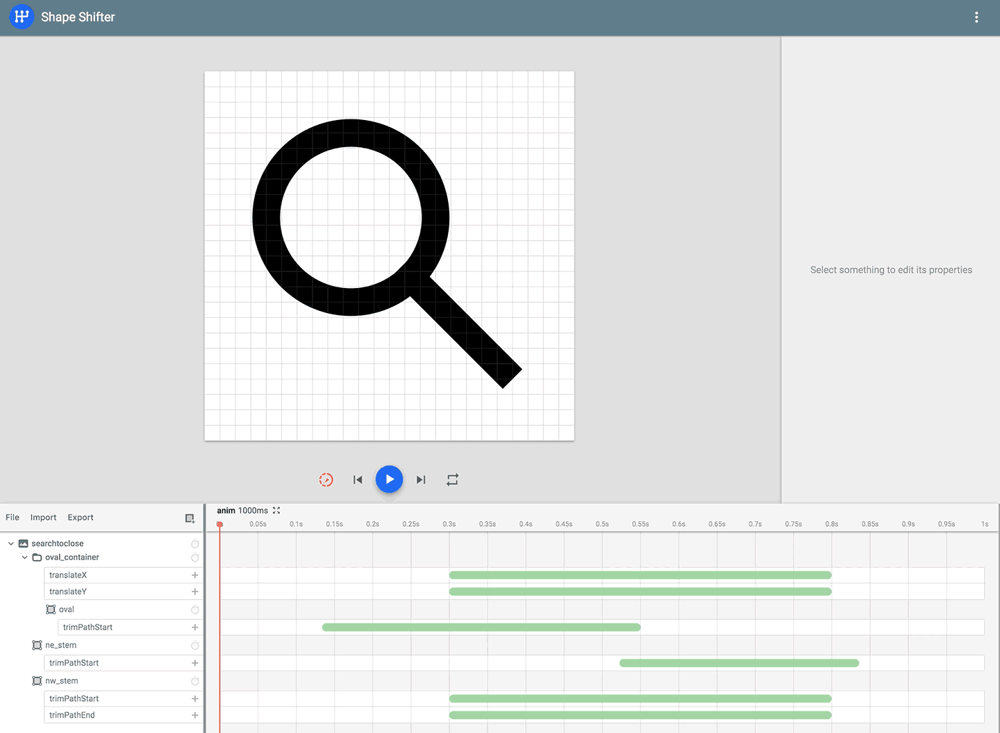

# Shape Shifter

[](https://travis-ci.org/alexjlockwood/ShapeShifter)

**[Go to Live Version](https://alexjlockwood.github.io/ShapeShifter/)**

-----

Shape Shifter is a simple web-app that greatly simplifies the process of
creating beautiful [path morphing animations][adp-path-morphing].

This tool currently exports to
[`AnimatedVectorDrawable`](https://developer.android.com/reference/android/graphics/drawable/AnimatedVectorDrawable.html)
format for Android. That said, I am totally open to adding support for other export formats as well.
File a [feature request][report-feature-request]!



## Problem

Writing high-quality [path morphing animations][adp-path-morphing]
is often a tedious and time-consuming task. In order to morph one shape into another,
the SVG paths describing the two must be *compatible* with each other&mdash;that is,
both must have the same number and type of drawing commands. This is problematic because:

* Design tools&mdash;such as [Sketch][sketch] and [Illustrator][illustrator]&mdash;do not easily
  expose the order of points in a shape, making it difficult to change their order.
* Design tools often map to shape primitives not supported in certain platforms
  (e.g. in Android, circles need to be represented by a sequence of curves and/or arcs,
  not simply by their center point and radius).
* Design tools cannot place multiple path points in the same location, a technique that
  is often necessary when making two shapes compatible with each other.
* No easy way to visualize the in-between states of the resulting path morphing animation.

## Features

Shape Shifter attempts to solve these problems by providing the following features:

* The ability to add/remove points to each path without altering their original appearance.
  The added points can be modified by dragging them to different positions along the path,
  and they can be later deleted using the keyboard as well.
* The ability to reverse/shift the relative positions of each path's points. While reordering
  points won't affect whether or not the paths are compatible, it *will* ultimately determine
  how the resulting path morphing animation is rendered.
* Shape Shifter automatically converts incompatible pairs of SVG commands into a compatible
  format. There's no longer any need to worry about converting `L`s into `Q`s, or `A`s
  into `C`s&mdash;Shape Shifter does this all for you behind-the-scenes!
* The ability to 'auto fix' paths. Auto fix is based on an adaptation of the
  [Needleman-Wunsch algorithm][Needleman-Wunsch], which is used in bioinformatics
  to align protein or nucleotide sequences.
* The ability to export the results to `AnimatedVectorDrawable` format for use in
  Android applications. I'm open to adding support for other export formats as well, so
  feel free to file a [feature request][report-feature-request]!

## Build instructions

If you want to contribute, you can build and serve the web app locally as follows:

  1. First install [`Node.js`](https://nodejs.org/) and [`npm`](https://www.npmjs.com/).

  2. Clone the repository and in the root directory, run:

    ```
    $ npm install
    ```

  3. To build and serve the web app locally, run:

    ```
    $ ng serve
    ```

  [report-feature-request]: https://github.com/alexjlockwood/ShapeShifter/issues/new
  [adp-path-morphing]: http://www.androiddesignpatterns.com/2016/11/introduction-to-icon-animation-techniques.html#morphing-paths
  [sketch]: https://www.sketchapp.com/
  [illustrator]: http://www.adobe.com/products/illustrator.html
  [Needleman-Wunsch]: https://en.wikipedia.org/wiki/Needleman%E2%80%93Wunsch_algorithm
